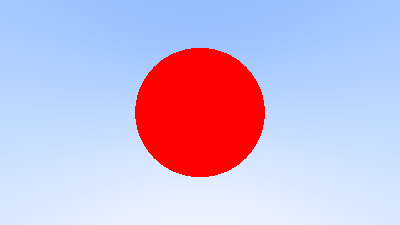
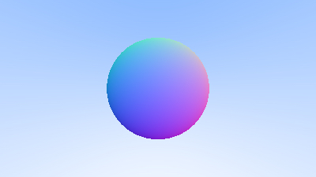

# About

In this repo I implement "[Ray Tracing In One Weekend](https://raytracing.github.io/)" book in Rust language.
This is an educational project for me. The main purpose of it is to learn and practice programming in Rust language.
It was inspired by the [greatest-ever Rust lectures](https://youtube.com/playlist?list=PLlb7e2G7aSpTfhiECYNI2EZ1uAluUqE_e)
taught by the [Aleksey Kladov](https://github.com/matklad)
in [Computer Science Center](https://compscicenter.ru/courses/rustprogramming/2019-spring/).

# Progress

Here are the result images I obtained while working on this project:

